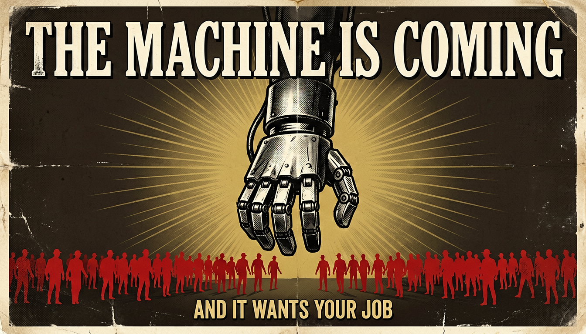
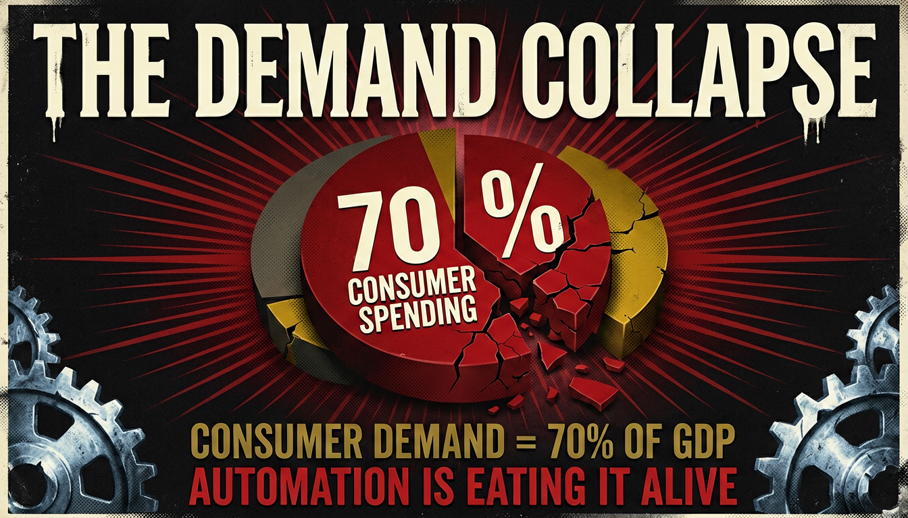
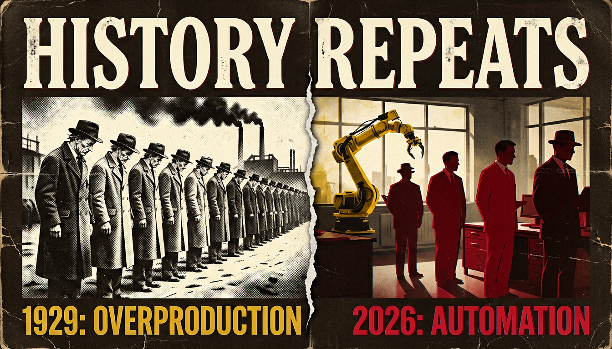
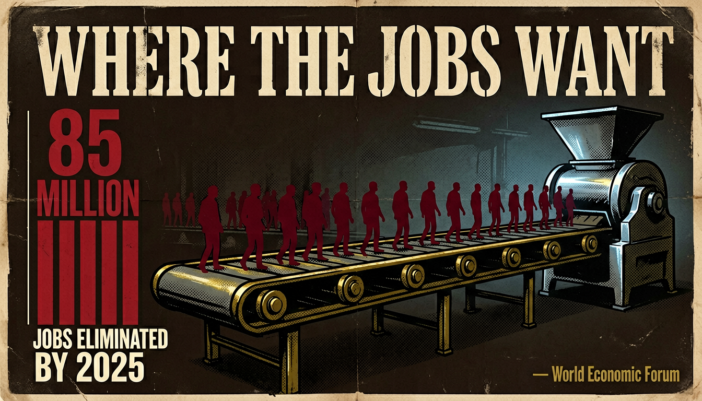
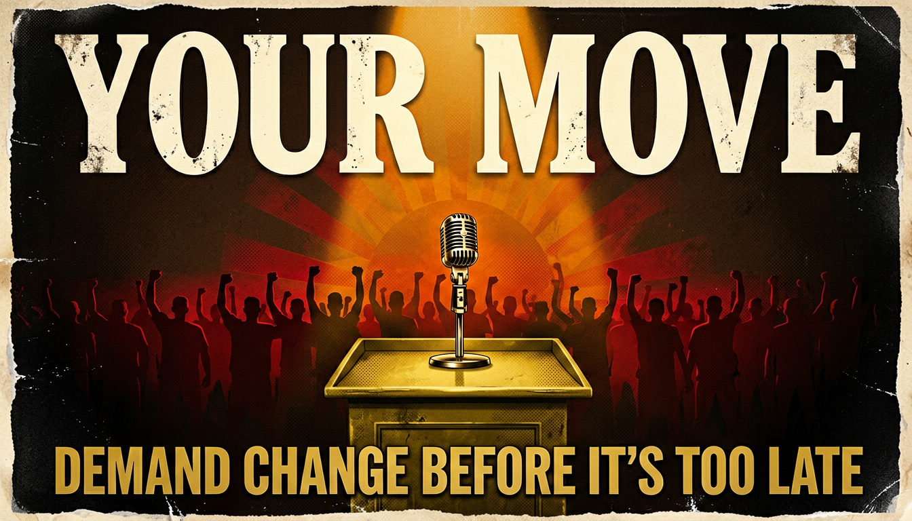

<p align="center">
  <h1 align="center">Gathos</h1>
  <p align="center"><strong>Open-source Gamma alternative. Plug into any AI agent.<br>Turn ideas into beautiful presentations — with video and voiceover.</strong></p>
</p>

<p align="center">
  
  
  
  
  
</p>

<p align="center">
  
  
  
</p>

---

## See it to believe it

> **Prompt:** *"How automation kills consumer demand — retro propaganda style, 15 slides"*

<p align="center">
  
  
</p>
<p align="center">
  
  
</p>
<p align="center">
  
  
</p>

<p align="center"><em>Not bullet points on white. Not templates with swapped text.<br>15 visually rich slides with a unified design system, consistent palette, and narration — all from one prompt.</em></p>

---

## The problem

Every AI tool today generates the same ugly presentations. You've seen them — **white background, bullet points, generic stock icons, "AI-looking" layouts** that all blend together. Whether it's ChatGPT, Claude, Manus, or any other agent — the output is always text-heavy slides that look like they were made by a robot in 2020.

And the paid alternatives?

- **Gamma** ($8-20/mo), **Beautiful.ai** ($12-45/mo), **Tome** ($7-10/mo) — locked into their editors, limited preset templates, no video output
- **PowerPoint + AI** — you still end up fighting templates for hours
- **ChatGPT / Claude / Manus** — generates bullet-point outlines, not actual visual presentations. The slides all look the same: plain, text-heavy, zero visual identity

**The result: every AI-generated presentation looks identical.** No visual storytelling. No design system. No personality. Just walls of text on white backgrounds.

### What if AI could generate presentations that actually look *designed*?

Not text on a white slide. Not bullet points with clip art. **Actually beautiful, visually rich slides** — with a unified color palette, custom typography, visual motifs that carry through every slide, and content that tells a story instead of listing facts.

## The solution

```bash
curl -sL https://raw.githubusercontent.com/yashaiguy-dev/gathos/main/install.sh | bash
```

One command. Gathos drops into your AI agent. Then just describe your idea:

```
You: "Create a presentation about why most startups fail — dark, cinematic, 10 slides"
```

Your agent builds a **complete design system** — color palette, typography, visual motifs — then generates every slide as a **full-bleed, visually rich image** with narration scripts. Not bullet points on white. Not text-heavy layouts. Actual visual storytelling.

You get a `.pptx` and an `.mp4`. Presentations that look like a designer spent days on them.

---

## What Gathos actually does

Gathos is a **skill** — a single file that turns any AI coding agent into a visual presentation studio.

It doesn't generate text slides. It generates **designed slides** — each one is a full 16:9 image with baked-in typography, data visualizations, visual metaphors, and a consistent design language across every slide.

It plugs into the agent you already use. No new app. No new subscription. No new workflow.

```
Your idea
    ↓
Your AI agent + Gathos skill
    ↓
Unified design system (colors, typography, visual motifs)
    ↓
AI-generated slide images (16:9, visually consistent, any style)
    ↓
Narration scripts (calibrated to slide timing)
    ↓
.pptx PowerPoint file (full-bleed slides + speaker notes)
    ↓
.mp4 video with AI voiceover (choose your voice)
```

### Any visual style. Any topic. Any agent.

Minimalist flat. Neon cyberpunk. Retro propaganda. Watercolor. Crayon sketch. Corporate clean. Anime. Cinematic dark. You describe it — the agent builds an entire design system around it and keeps every slide visually consistent.

---

## Works with every agent

| Agent | How to install | How to use |
|-------|---------------|------------|
| **Claude Code** (CLI, Desktop, VS Code, JetBrains) | `~/.claude/commands/` | `/idea-to-presentation` |
| **Gemini CLI** | `~/.gemini/commands/` | Ask naturally |
| **Cursor** | `.cursor/rules/` | Ask naturally |
| **Windsurf** | `.windsurf/rules/` | Ask naturally |
| **Aider** | Paste as system prompt | Ask naturally |
| **Copilot** | Add as context file | Ask naturally |
| **Any agent that can run shell commands** | Drop the file in | Ask naturally |

It's a `.md` file. If your agent can read a file and run `curl` + `python3`, it works.

---

## Use cases

### YouTube creators
Generate visually stunning presentation videos for explainers, tutorials, and faceless content. Pick a voice. Get an `.mp4`. Upload directly.

### Founders & startups
Pitch decks in minutes, not days. Consistent design system across every slide. Iterate by talking to your agent: *"Make slide 3 more impactful"* — done.

### Educators & students
Turn any topic into a visual lecture with narration. The agent builds narrative arcs, diagrams, and timing-calibrated voiceover scripts.

### Developers & technical talks
Conference talks, internal demos, architecture overviews. The skill adapts — educational content gets diagrams, technical content gets flowcharts and annotated layouts.

### Content creators
Blog post to presentation. Thread to slides. Idea to video. Any visual style you can describe. The agent builds it.

---

## Why Gathos vs. the rest

| | **ChatGPT / Claude / Manus** | **Gamma** | **Beautiful.ai** | **Gathos** |
|---|:---:|:---:|:---:|:---:|
| Price | Free-$20/mo | $8-20/mo | $12-45/mo | **Free** |
| Visual quality | Text-heavy, generic | Template-based | Template-based | **Full-bleed designed images** |
| Design system | None | Basic theme | Basic theme | **Custom palette, motifs, typography** |
| Visual styles | One (plain text) | Limited presets | Limited presets | **Unlimited (any style you describe)** |
| Output feels like... | Bullet points from a robot | A template with AI text | A template with AI text | **A designer spent days on it** |
| Video with voiceover | No | No | No | **Yes** |
| Works in your IDE/terminal | Yes | No | No | **Yes** |
| Open source | No | No | No | **Yes** |
| Presentation + video | Text slides only | Slides only | Slides only | **.pptx + .mp4** |
| Lock-in | None | Their editor | Their editor | **None** |
| Iterate with AI | Basic chat | Basic edit | Basic edit | **Full conversation** |

> Gamma Plus: $8/mo (annual) or $10/mo monthly. Pro: $15-20/mo. Beautiful.ai Pro: $12/mo (annual) or $45/mo monthly. Team: $40-50/user/mo. **Gathos is free forever.**

---

## Install

### One command (recommended)

```bash
curl -sL https://raw.githubusercontent.com/yashaiguy-dev/gathos/main/install.sh | bash
```

Auto-detects your agent and installs the skill in the right place.

### Manual install

<details>
<summary><strong>Claude Code</strong></summary>

```bash
mkdir -p ~/.claude/commands
curl -sL https://raw.githubusercontent.com/yashaiguy-dev/gathos/main/idea-to-presentation.md \
  -o ~/.claude/commands/idea-to-presentation.md
```
Then type: `/idea-to-presentation`
</details>

<details>
<summary><strong>Gemini CLI</strong></summary>

```bash
mkdir -p ~/.gemini/commands
curl -sL https://raw.githubusercontent.com/yashaiguy-dev/gathos/main/idea-to-presentation.md \
  -o ~/.gemini/commands/idea-to-presentation.md
```
Then ask: *"Create a presentation about [your idea]"*
</details>

<details>
<summary><strong>Cursor</strong></summary>

```bash
mkdir -p .cursor/rules
curl -sL https://raw.githubusercontent.com/yashaiguy-dev/gathos/main/idea-to-presentation.md \
  -o .cursor/rules/idea-to-presentation.md
```
Then ask: *"Create a presentation about [your idea]"*
</details>

<details>
<summary><strong>Windsurf</strong></summary>

```bash
mkdir -p .windsurf/rules
curl -sL https://raw.githubusercontent.com/yashaiguy-dev/gathos/main/idea-to-presentation.md \
  -o .windsurf/rules/idea-to-presentation.md
```
Then ask: *"Create a presentation about [your idea]"*
</details>

<details>
<summary><strong>Any other agent</strong></summary>

Download `idea-to-presentation.md` and either:
- Add it to your agent's system prompt / rules directory
- Paste the contents as context at the start of your conversation

The skill is self-contained — it tells the agent exactly what to do.
</details>

---

## Connect Gathos APIs (optional)

**Steps 1-4 are completely free.** Without any API key, you get a full presentation blueprint:

<details>
<summary><strong>Example: what you get without any API key (click to expand)</strong></summary>

When you say *"How AI will affect consumer demand — neon cyberpunk, 10 slides"*, the agent generates:

**Design System:**
```json
{
  "color_palette": {
    "background": "#0A0E1A",
    "primary": "#00F0FF",
    "secondary": "#FF2E63",
    "accent": "#FFD700",
    "text": "#E8E8E8"
  },
  "visual_motifs": ["holographic data streams", "crumbling shopping carts", "glitch effects"],
  "typography_style": "Wide-tracked uppercase condensed for headlines, clean mono for data",
  "mood": "ominous, electric, data-driven"
}
```

**Slide 1 — Image Prompt:**
> A wide 16:9 neon cyberpunk illustration. Deep #0A0E1A background with subtle grid lines in #00F0FF fading into the distance. Center frame: a massive holographic shopping cart rendered in wireframe #00F0FF, slowly dissolving into digital particles that drift upward. Inside the cart: glowing product boxes flickering and glitching in #FF2E63. Top of frame: "THE CONSUMER COLLAPSE" in massive wide-tracked uppercase #E8E8E8 with a #FF2E63 glow. Bottom right: "WHEN AI REPLACES PAYCHECKS, WHO BUYS?" in smaller mono #FFD700. Horizontal scan lines and chromatic aberration across the frame. Atmosphere: eerie digital decay, economic warning.

**Slide 1 — Narration:**
> "Every economy runs on one simple engine: people buying things. But what happens when artificial intelligence starts replacing the very paychecks that fuel consumer spending?"

You get this for **every slide** — image prompt, on-screen text, narration script. Feed the prompts into any image generator. Feed the narration into any TTS. Or connect Gathos APIs and let the agent do it all automatically.

</details>

### Unlock one-click generation

To unlock **automatic AI slide generation + voiceover**, get your API keys at **[gathos.com](https://gathos.com)**:

```bash
# Add to ~/.zshrc or ~/.bashrc
export GATHOS_IMAGE_API_KEY="your_key_here"
export GATHOS_TTS_API_KEY="your_key_here"
```

**Available TTS voices:** josh, koko, pixxy, prof, rochie, spraky

### What each key unlocks

| What you get | API key needed? |
|---|:---:|
| Design system + image prompts + narration scripts | No — free |
| AI-generated slide images (16:9 PNG) | `GATHOS_IMAGE_API_KEY` |
| PowerPoint `.pptx` assembly | No — free (needs `python-pptx`) |
| AI voiceover in your chosen voice | `GATHOS_TTS_API_KEY` |
| Video `.mp4` assembly | No — free (needs `ffmpeg`) |

### System requirements (for full pipeline)

```bash
pip3 install python-pptx Pillow    # PowerPoint assembly
brew install ffmpeg                 # Video assembly (Mac)
# or: sudo apt install ffmpeg       # Video assembly (Linux)
```

---

## How it works under the hood

```
You give an idea
      │
      ▼
┌─────────────────────────────┐
│  Step 1: Collect inputs      │  Idea, tone, audience, visual style, slide count
│  Step 2: Design system       │  Color palette, motifs, typography, narrative arc
│  Step 3: Expand slides       │  Image prompts, on-screen text, narration for every slide
│  Step 4: Write JSON          │  Structured blueprint saved to disk
└─────────────┬───────────────┘
              │  FREE — no API key needed
              ▼
┌─────────────────────────────┐
│  Step 5: Generate images     │  Gathos Image API → 16:9 slide PNGs
│  Step 6: Assemble .pptx      │  Full-bleed slides + speaker notes
│  Step 7: Generate voiceover  │  Gathos TTS API → narration audio
│  Step 8: Assemble .mp4       │  ffmpeg → final video with voiceover
└─────────────────────────────┘
              │
              ▼
        .pptx + .mp4
```

Every slide gets:
- **Image prompt** — 4-8 sentences with hex colors, text placement, style details, and visual continuity between slides
- **On-screen text** — headlines, stats, bullet points, callouts, diagrams, code snippets
- **Narration** — voiceover script at ~3 words/second, matching your tone, never just reading the slide

---

## Editing & iteration

Talk to your agent to refine anything:

- **"Redo slide 3"** — regenerates just that slide, keeps everything else
- **"Change the style to watercolor"** — new design system, all slides regenerated
- **"Add 2 more slides about the competition"** — recalculates pacing, expands
- **"Make it more hype"** — adjusts tone across narration
- **"Show me the outline first"** — preview the structure before committing

This is the advantage of living inside your agent — iteration is a conversation, not a UI.

---

## License

MIT — use it, fork it, ship it, sell it. Do whatever you want.

---

<p align="center">
  <strong>One idea. One command. Beautiful presentation.</strong><br><br>
  <code>curl -sL https://raw.githubusercontent.com/yashaiguy-dev/gathos/main/install.sh | bash</code><br><br>
  <a href="https://gathos.com">Get API keys at gathos.com</a>
</p>
