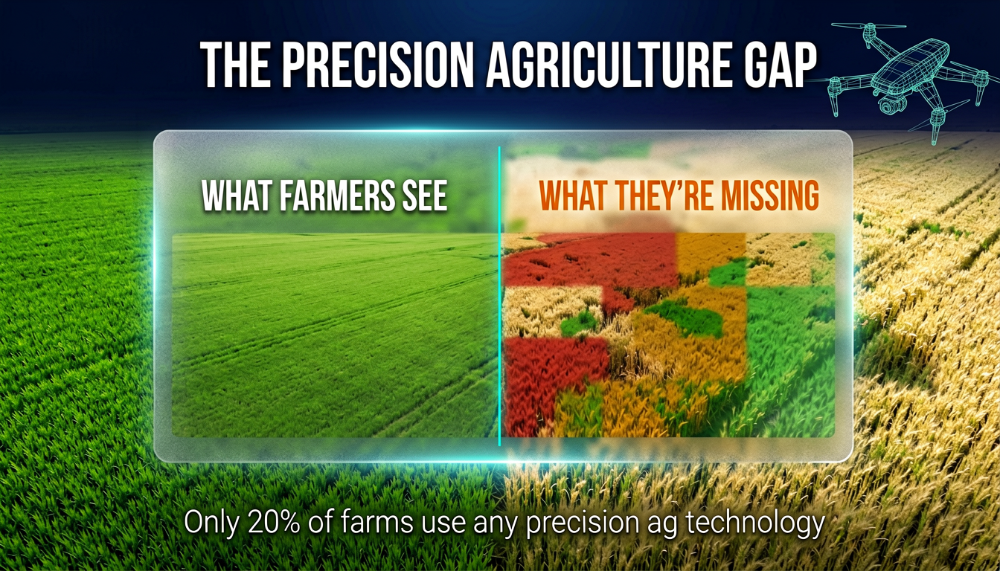
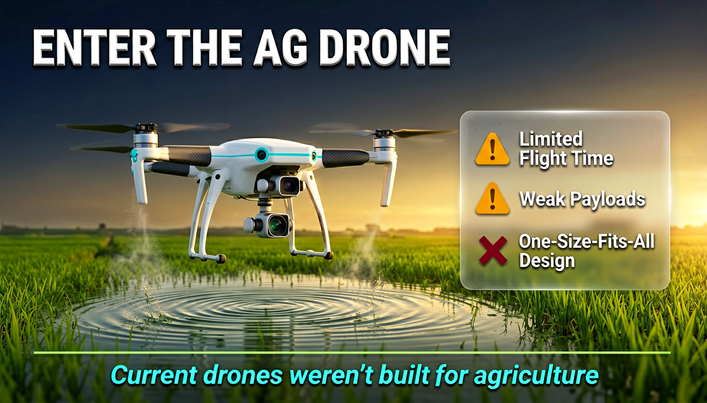
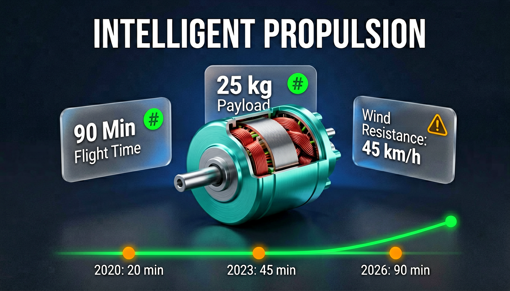
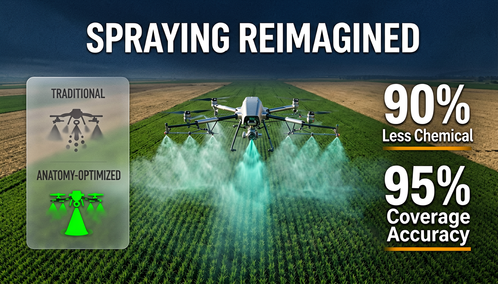
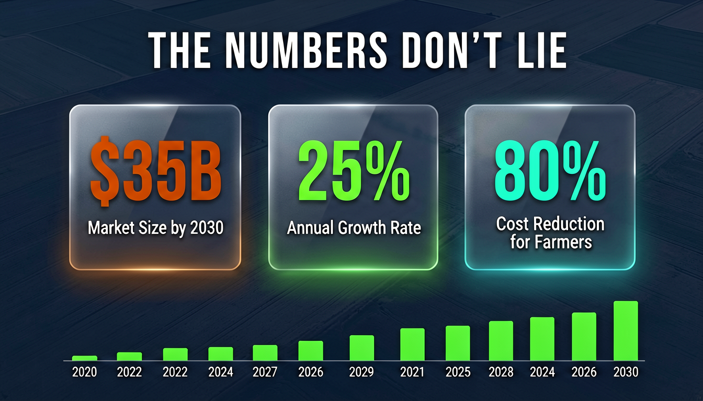

<p align="center">
  <h1 align="center">Gathos</h1>
  <p align="center"><strong>The AI agent skill that creates beautiful presentations.</strong></p>
  <p align="center">One skill. Any agent. Visually stunning slides + video with voiceover.</p>
</p>

<p align="center">
  
  
  
  
  
</p>

<p align="center">
  
  
</p>

---

## See it to believe it

> **Prompt:** *"How automation kills consumer demand — retro propaganda style, 15 slides"*

<p align="center">
  
  
</p>
<p align="center">
  
  
</p>
<p align="center">
  
  
</p>

<p align="center"><em>15 slides. Retro propaganda style. Unified design system. All from one prompt.</em></p>

<br>

> **Prompt:** *"Investor pitch on drone anatomy in agriculture — clean tech, aerial photography, 15 slides"*

<p align="center">
  
  
</p>
<p align="center">
  
  
</p>
<p align="center">
  
  
</p>

<p align="center"><em>Same skill. Completely different style. Professional investor pitch with data visualizations, product shots, and market stats.</em></p>

<br>

<p align="center"><strong>Not templates. Not bullet points. Not text on white.<br>This is what your AI agent can do now.</strong></p>

---

## The problem: AI presentations look terrible

You've asked your AI agent to make a presentation. We all have. And every time, the result is the same:

**White background. Bullet points. Generic icons. Text-heavy layouts that scream "a robot made this."**

It doesn't matter which agent you use — ChatGPT, Claude, Gemini, Cursor, Manus — they all generate the same thing. Plain text organized into slides. No visual identity. No design system. No storytelling. Just information dumped onto white rectangles.

And the standalone presentation tools?

- **Gamma** ($8-20/mo) — template-based, locked in their editor, every deck looks the same
- **Beautiful.ai** ($12-45/mo) — prettier templates, still limited presets, still their editor
- **Tome** ($7-10/mo) — pivoted away from presentations entirely

**The gap:** Your AI agent is incredibly powerful — it can write code, debug systems, build entire apps. But ask it to make a presentation and it gives you the visual equivalent of a Word document.

### Gathos closes that gap.

It's a **skill** you install into your agent. One file. After that, your agent doesn't generate text slides — it generates **visually designed presentations** with:

- A unified **design system** (color palette, typography, visual motifs)
- **Full-bleed slide images** in any style you can describe
- **Narration scripts** calibrated to timing
- A finished **`.pptx`** and optional **`.mp4` video with AI voiceover**

The same agent that was giving you bullet points on white now gives you slides that look like a professional designer spent days on them.

---

## Install — one command

```bash
curl -sL https://raw.githubusercontent.com/yashaiguy-dev/gathos/main/install.sh | bash
```

That's it. The installer auto-detects your agent (Claude Code, Gemini CLI, Cursor, Windsurf) and drops the skill in the right place.

Then just talk to your agent:

```
You: "Create a presentation about the future of remote work — cinematic dark, 10 slides"
```

Your agent takes it from there.

---

## What your agent does with Gathos

```
Your idea ("the future of remote work — cinematic dark, 10 slides")
      │
      ▼
  Asks you: tone, audience, visual style, slide count
      │
      ▼
  Builds a unified design system
  (color palette, typography, visual motifs, mood)
      │
      ▼
  Generates every slide:
  • Detailed image prompt (4-8 sentences, hex colors, text placement)
  • On-screen text (headlines, stats, callouts, diagrams)
  • Narration script (timed to slide duration, never reads the slide)
      │
      ▼
  Creates AI-generated slide images (16:9, visually consistent)
      │
      ▼
  Assembles .pptx (full-bleed slides + speaker notes)
      │
      ▼
  Optional: generates .mp4 video with AI voiceover
```

### Before Gathos vs. After Gathos

| | Without Gathos | With Gathos |
|---|---|---|
| **What you get** | Bullet points on white backgrounds | Full-bleed designed slide images |
| **Design system** | None — every slide looks different | Unified palette, typography, motifs across all slides |
| **Visual style** | One: plain text | Anything — cyberpunk, propaganda, watercolor, minimalist, anime... |
| **Content quality** | Lists of facts | Visual storytelling with narrative arc |
| **Video output** | No | `.mp4` with AI voiceover |
| **Feels like** | A robot dumped text onto slides | A designer spent days on it |

---

## Any style you can describe

Minimalist flat. Neon cyberpunk. Retro propaganda. Watercolor. Crayon sketch. Corporate clean. Anime. Cinematic dark. Vaporwave. Bauhaus. You name it — the agent builds a complete design system around your description and keeps every slide visually consistent.

**Every slide gets:**
- **Image prompt** — 4-8 sentences with hex colors, text placement, lighting, mood, and visual continuity from the previous slide
- **On-screen text** — headlines, stats, bullet points, callouts, diagrams, code snippets, footnotes
- **Narration** — voiceover script at ~3 words/second, matches your tone, complements the visual instead of reading it

---

## Works with every agent

| Agent | How to install | How to use |
|-------|---------------|------------|
| **Claude Code** (CLI, Desktop, VS Code, JetBrains) | `~/.claude/commands/` | `/idea-to-presentation` |
| **Gemini CLI** | `~/.gemini/commands/` | Ask naturally |
| **Cursor** | `.cursor/rules/` | Ask naturally |
| **Windsurf** | `.windsurf/rules/` | Ask naturally |
| **Aider** | Paste as system prompt | Ask naturally |
| **Copilot** | Add as context file | Ask naturally |
| **Any agent that can run shell commands** | Drop the file in | Ask naturally |

It's a single `.md` file. If your agent can read a file and run `curl` + `python3`, it works.

<details>
<summary><strong>Manual install instructions (click to expand)</strong></summary>

**Claude Code:**
```bash
mkdir -p ~/.claude/commands
curl -sL https://raw.githubusercontent.com/yashaiguy-dev/gathos/main/idea-to-presentation.md \
  -o ~/.claude/commands/idea-to-presentation.md
```

**Gemini CLI:**
```bash
mkdir -p ~/.gemini/commands
curl -sL https://raw.githubusercontent.com/yashaiguy-dev/gathos/main/idea-to-presentation.md \
  -o ~/.gemini/commands/idea-to-presentation.md
```

**Cursor:**
```bash
mkdir -p .cursor/rules
curl -sL https://raw.githubusercontent.com/yashaiguy-dev/gathos/main/idea-to-presentation.md \
  -o .cursor/rules/idea-to-presentation.md
```

**Windsurf:**
```bash
mkdir -p .windsurf/rules
curl -sL https://raw.githubusercontent.com/yashaiguy-dev/gathos/main/idea-to-presentation.md \
  -o .windsurf/rules/idea-to-presentation.md
```

**Any other agent:** Download `idea-to-presentation.md` and add it to your agent's system prompt or rules directory.
</details>

---

## Use cases

### YouTube creators
Visually stunning presentation videos for explainers, tutorials, and faceless content. Pick a voice. Get an `.mp4`. Upload directly.

### Founders & startups
Pitch decks in minutes, not days. Consistent design across every slide. Iterate naturally: *"Make slide 3 more impactful"* — done.

### Educators & students
Turn any topic into a visual lecture with narration. Narrative arcs, diagrams, timing-calibrated voiceover.

### Developers & technical talks
Conference talks, internal demos, architecture overviews. The skill adapts — educational content gets labeled diagrams, technical content gets flowcharts.

### Content creators
Blog post to presentation. Thread to slides. Idea to video. Any visual style. The agent builds it.

---

## Why Gathos vs. everything else

| | **Your AI agent (no skill)** | **Gamma** | **Beautiful.ai** | **Your agent + Gathos** |
|---|:---:|:---:|:---:|:---:|
| Price | Free | $8-20/mo | $12-45/mo | **Free** |
| Visual quality | Text on white | Template presets | Template presets | **Full-bleed designed images** |
| Design system | None | Basic theme picker | Basic theme picker | **Custom palette, motifs, typography** |
| Visual styles | One (plain text) | ~20 templates | ~20 templates | **Unlimited (describe any style)** |
| Output looks like... | A robot made it | A template with swapped text | A template with swapped text | **A designer spent days on it** |
| Video + voiceover | No | No | No | **Yes (.mp4 with AI voice)** |
| Works in your IDE | Yes | No (their website) | No (their website) | **Yes** |
| Open source | N/A | No | No | **Yes (MIT)** |
| Iterate by talking | Basic | Basic edit UI | Basic edit UI | **Full conversation** |
| Lock-in | None | Their editor | Their editor | **None — .pptx is yours** |

> Gamma Plus: $8/mo annual, $10/mo monthly. Pro: $15-20/mo. Beautiful.ai Pro: $12/mo annual, $45/mo monthly. Team: $40-50/user/mo. **Gathos is free.**

---

## Connect Gathos APIs (optional)

**The skill works without any API key.** Your agent generates the full presentation blueprint — design system, image prompts, narration scripts — for free. You can feed those prompts into any image generator or TTS you want.

To unlock **automatic image generation + voiceover** inside the agent, get your API keys at **[gathos.com](https://gathos.com)**:

```bash
# Add to ~/.zshrc or ~/.bashrc
export GATHOS_IMAGE_API_KEY="your_key_here"
export GATHOS_TTS_API_KEY="your_key_here"
```

**Available TTS voices:** josh, koko, pixxy, prof, rochie, spraky

<details>
<summary><strong>Example: what you get without any API key (click to expand)</strong></summary>

When you say *"How AI will affect consumer demand — neon cyberpunk, 10 slides"*, the agent generates:

**Design System:**
```json
{
  "color_palette": {
    "background": "#0A0E1A",
    "primary": "#00F0FF",
    "secondary": "#FF2E63",
    "accent": "#FFD700",
    "text": "#E8E8E8"
  },
  "visual_motifs": ["holographic data streams", "crumbling shopping carts", "glitch effects"],
  "typography_style": "Wide-tracked uppercase condensed for headlines, clean mono for data",
  "mood": "ominous, electric, data-driven"
}
```

**Slide 1 — Image Prompt:**
> A wide 16:9 neon cyberpunk illustration. Deep #0A0E1A background with subtle grid lines in #00F0FF fading into the distance. Center frame: a massive holographic shopping cart rendered in wireframe #00F0FF, slowly dissolving into digital particles that drift upward. Inside the cart: glowing product boxes flickering and glitching in #FF2E63. Top of frame: "THE CONSUMER COLLAPSE" in massive wide-tracked uppercase #E8E8E8 with a #FF2E63 glow. Bottom right: "WHEN AI REPLACES PAYCHECKS, WHO BUYS?" in smaller mono #FFD700. Horizontal scan lines and chromatic aberration across the frame. Atmosphere: eerie digital decay, economic warning.

**Slide 1 — Narration:**
> "Every economy runs on one simple engine: people buying things. But what happens when artificial intelligence starts replacing the very paychecks that fuel consumer spending?"

You get this for **every slide**. Feed the prompts into Midjourney, DALL-E, Flux, or any image generator. Or connect Gathos APIs and the agent does it all automatically.
</details>

### What each key unlocks

| What you get | API key needed? |
|---|:---:|
| Design system + image prompts + narration scripts | No — free |
| AI-generated slide images (16:9 PNG) | `GATHOS_IMAGE_API_KEY` |
| PowerPoint `.pptx` assembly | No — free (needs `python-pptx`) |
| AI voiceover in your chosen voice | `GATHOS_TTS_API_KEY` |
| Video `.mp4` assembly | No — free (needs `ffmpeg`) |

### System requirements (for full pipeline)

```bash
pip3 install python-pptx Pillow    # PowerPoint assembly
brew install ffmpeg                 # Video assembly (Mac)
# or: sudo apt install ffmpeg       # Video assembly (Linux)
```

---

## Editing & iteration

This is the power of being a skill inside your agent — iteration is a conversation:

- **"Redo slide 3"** — regenerates just that slide, keeps everything else
- **"Change the style to watercolor"** — new design system, all slides regenerated
- **"Add 2 more slides about the competition"** — recalculates pacing, expands
- **"Make it more hype"** — adjusts tone across narration
- **"Show me the outline first"** — preview the structure before committing

Try doing that in Gamma. You can't — you're clicking through their UI. Here, you just talk.

---

## License

MIT — use it, fork it, ship it, sell it.

---

<p align="center">
  <strong>Your AI agent already writes code, debugs systems, and builds apps.<br>Now it makes beautiful presentations too.</strong><br><br>
  <code>curl -sL https://raw.githubusercontent.com/yashaiguy-dev/gathos/main/install.sh | bash</code><br><br>
  <a href="https://gathos.com">Get API keys at gathos.com</a> to unlock image generation + voiceover
</p>
